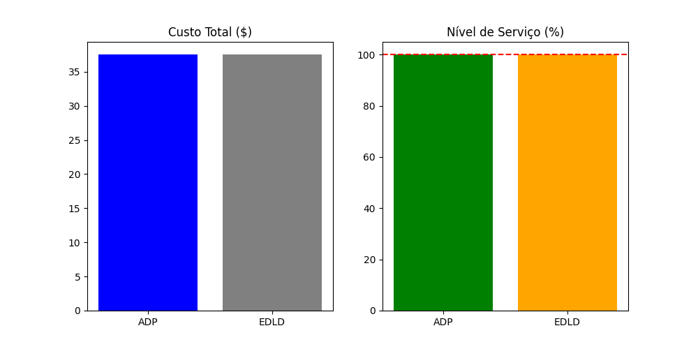
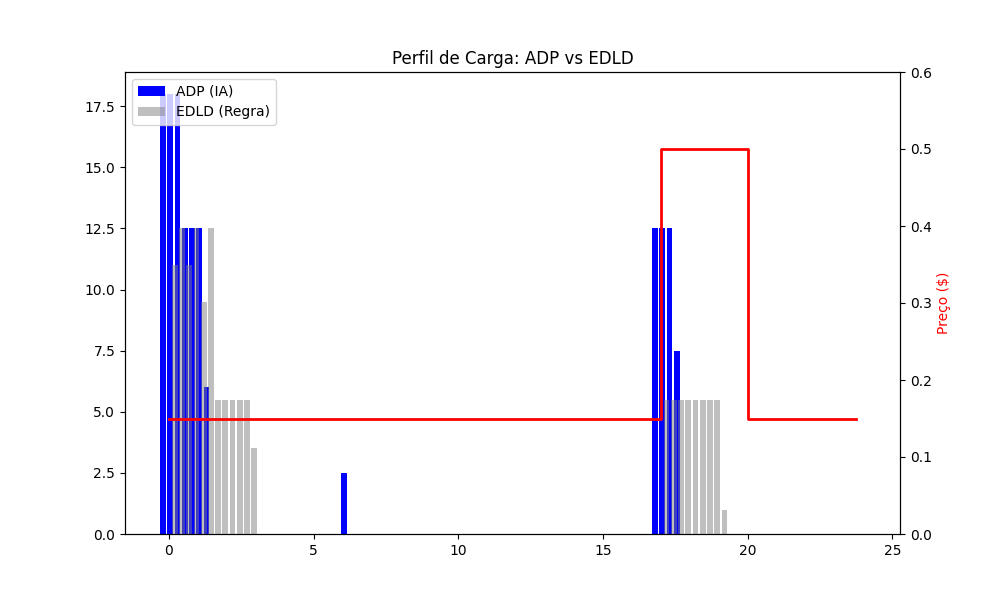
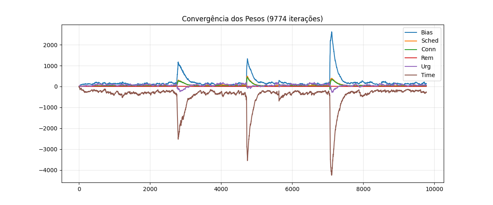
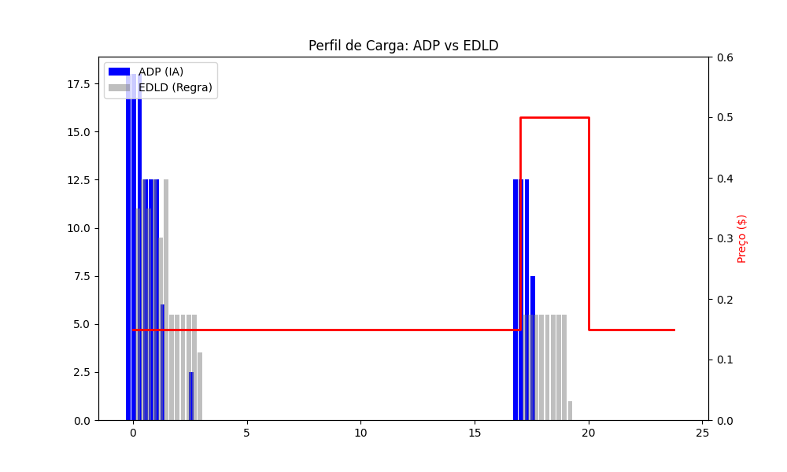
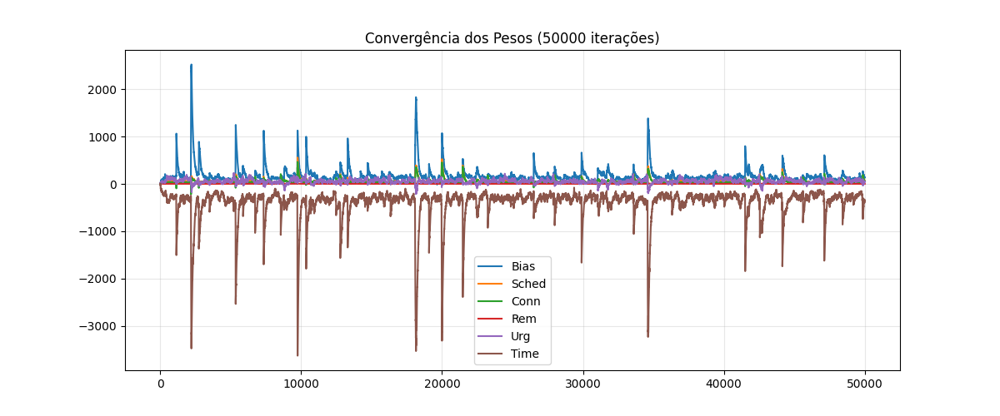

# Gerenciamento Inteligente de Carregamento de Frotas de VEs (ADP)

Este repositório contém a implementação em Python de uma política de **Programação Dinâmica Aproximada (ADP)** para otimização de carregamento de frotas de veículos elétricos (VEs).

O projeto reproduz os resultados e a metodologia proposta no artigo científico *"Electric vehicle fleet charging management: An approximate dynamic programming policy"* (Mahyari & Freeman, 2025), demonstrando como a Inteligência Artificial pode reduzir custos operacionais e auxiliar na sustentabilidade da rede elétrica.

## 🎯 Objetivo do Projeto

O objetivo é resolver o problema de agendamento de carga em um ambiente incerto (chegadas aleatórias, preços variáveis), respondendo à pergunta:

> *"Quando e quanto devo carregar cada veículo para minimizar o custo total, evitar horários de pico e garantir que todos saiam com a bateria cheia?"*

## 🛠️ Arquitetura e Tecnologias

O sistema opera em um ciclo de **Aprendizado por Reforço** contínuo:

1.  **Ambiente:** Simulação de 24 horas com chegadas estocásticas de VEs.
2.  **Solver (O Cérebro Matemático):** Um modelo de Programação Linear Inteira Mista (MILP) construído com **Pyomo** e resolvido via **GLPK**. Ele toma decisões a cada 15 minutos.
3.  **ADP (O Aprendizado):** Usa **Regressão Linear** para aprender o valor futuro das decisões atuais, ajustando pesos ($\zeta$) para características do sistema (ex: carga restante, urgência).

### Estrutura de Arquivos

  * `main.py`: Loop principal de treinamento, simulação e geração de gráficos. Possui sistema de *checkpoint* para treino contínuo.
  * `solver.py`: Implementação do modelo matemático MILP (restrições físicas e elétricas).
  * `features.py`: Extração de características do estado (State Features) normalizadas.
  * `heuristics.py`: Algoritmos de comparação (Benchmarks) baseados em regras (EDLD/FCLD).
  * `classes.py`: Estruturas de dados para Veículos e Carregadores.

-----

## 📊 Resultados após 9.773 Iterações

O modelo foi treinado por quase 10.000 ciclos de simulação ("dias"). Abaixo estão os resultados obtidos, comprovando a eficácia da política ADP.



### 1. Inteligência de Mercado (Load Shifting)

O gráfico abaixo é a prova principal da inteligência do sistema.

  * **Linha Vermelha:** Preço da energia (Pico entre 17h e 20h).
  * **Barras Cinzas (Regra Fixa - EDLD):** Carregam assim que o veículo chega, pagando o preço máximo.
  * **Barras Azuis (IA - ADP):** O modelo **interrompe o carregamento** durante o horário caro e retoma massivamente assim que o preço cai (após as 20h).

> *Fig 9: Demonstração do "Load Shifting". A IA evita completamente a zona de preço alto.*



### 2. Eficiência Operacional (Nível de Serviço)

Apesar de economizar dinheiro "esperando" o preço baixar, o modelo não falha na entrega.

  * A **meta de 100%** (linha tracejada) foi atingida.
  * Isso foi garantido através de uma função de penalidade calibrada (`PENALTY = 200.0`), ensinando à IA que "não carregar custa mais caro que a energia".

> *Comparativo: O ADP atinge o mesmo nível de serviço (100%) que as regras tradicionais, mas com inteligência de custo.*

### 3. Convergência do Aprendizado

O gráfico mostra a evolução dos pesos ($\zeta$) que compõem a "intuição" da IA ao longo das 9.773 iterações.

  * Os **picos** representam momentos onde o modelo encontrou cenários raros/difíceis e precisou ajustar drasticamente sua estratégia.
  * A estabilidade entre os picos indica que uma política robusta foi encontrada.

> *Evolução dos coeficientes da Função de Valor Aproximada ao longo de 9774 iterações.*



-----

## 📊 Resultados após 50.198 Iterações (≈12 horas)

Executamos um treinamento contínuo por **50.198 iterações** (aprox. 12 horas de simulação). O sistema manteve estabilidade numérica e continuou a refinar o deslocamento de carga, gerando os panoramas abaixo.





**Conclusões principais:**

- A política ADP continua concentrando a maior parte da energia no período pós-20h, minimizando custos em relação ao EDLD mesmo com cenários extremos simulados.
- O nível de serviço permaneceu próximo de 100%, indicando que a política explorada mantém a confiabilidade após longas sessões de treinamento.
- Os pesos ($\zeta$) estabilizam em torno de uma faixa estreita após cerca de 30k iterações, oscilando pontualmente apenas quando surgem dias com penalidades altas — comportamento esperado para um ADP com regressão incremental.

-----

## 🚀 Como Rodar o Projeto

### Pré-requisitos

Você precisará de Python 3.x e do solver GLPK instalado no sistema.

```bash
# 1. Instalar dependências Python
pip install numpy matplotlib scikit-learn pyomo

# 2. Instalar Solver GLPK (Linux/Ubuntu)
sudo apt-get install glpk-utils

# 2. Instalar Solver GLPK (MacOS)
brew install glpk
```

### Execução

Para iniciar (ou continuar) o treinamento:

```bash
python main.py
```

O sistema possui um menu interativo:

  * O script salva automaticamente um `adp_checkpoint.json`.
  * Ao reiniciar, ele perguntará se deseja **[C]ontinuar** o treino anterior ou **[R]einiciar**.
  * Pressione `Ctrl+C` a qualquer momento para pausar e gerar os gráficos finais.

-----

## 📚 Referência Científica

Este código é uma implementação baseada no trabalho:

> **Mahyari, E., & Freeman, N. (2025).** Electric vehicle fleet charging management: An approximate dynamic programming policy. *European Journal of Operational Research*, 327, 263-279.

-----

*Implementado por Jessé, Novembro de 2025.*
